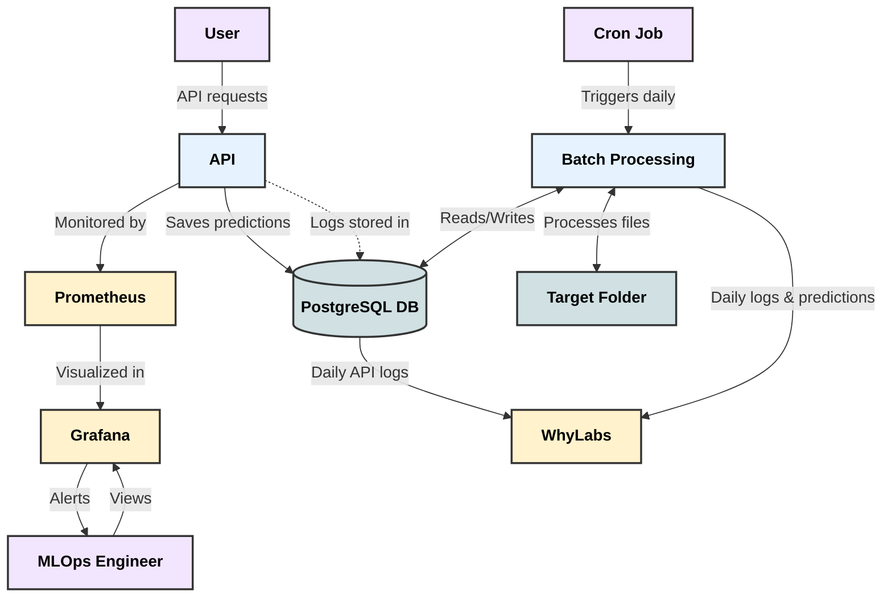

# Data Scientist

#### Technical Skills: Python, SQL, AWS, Cypher, NEO4J, R

## Education
- M.S., economics	| The Hebrew University of Jerusalem (_May 2023_)
  grade: 97, Dean's list 2023,graduation with first class honors award of excellence for the thesis work. 			        		
- B.S., law and economics | The Hebrew University of Jerusalem (_May 2019_)
  dean's lists in the years 2016, 2017, 2018.

## Work Experience
**Legal Advisor and innovation officer (captain's rank) (_April 2019 - December 2024_)**
- took part in Developing and implementing technological tools for the legal department within the Azure environment, including  a Retrieval Augmented Generation (RAG) model for addressing legal queries, a summary model and automatic document labeling system. The project received an award of excellence from the chief military attorney general Yifat Tomer Yerushalmi.
- Legal Advisor specializing in energy, communications, water, quarry, and construction law.
- Managed teams, provided legal counsel to senior executives, and represented the organization in Knesset hearings.
- Board Member of the Quarry Restoration Fund for the Judea and Samaria region from 2022 to 2024.

**Research Assistant and Teaching Assistant at  The Hebrew University of Jerusalem (_Jan 2017 - Jan 2019_)**
- Research assistant for a collaborative project with Brown University, estimating the empirical impact of changing protective tariffs in Israel on employment
- teaching assistant.

## Projects
### A knowledge graph-based information storage and retrieval solution for chatbots in the Graph-RAG architecture
[project repo](https://github.com/YotamAflalo/chyper-graphRAG-with-langchain-and-neo4j)

Storing information from thousands of pages in the field of healthcare in a knowledge graph, 
and building a mechanism for retrieving knowledge with a chatbot interface using a smart agent based on the RAG tool, 
retrieving information from a knowledge graph using cypher queries and a large language model.

### MLOps-TeleChurnPredictor

[project repo](https://github.com/YotamAflalo/MLOps-TeleChurnPredictor)

This project implements a full MLOPS solution for machine learning model for customer churn prediction, utilizing FastAPI and Apache Beam. It includes a comprehensive MLOps pipeline with monitoring, batch processing, and CI/CD integration.
The project include this features:
- FastAPI application for single predictions
- Apache Beam implementation for batch processing
- Monitoring of API and machine with Prometheus
- Error monitoring and alerting with Grafana and Grafana Standing Dashboard
- Automated scheduler for batch processing
- PostgreSQL database for prediction and data storage
- Whylogs data drift monitoring
- Full CI/CD pipeline and testing

The presenation of this project can be found [here](https://gamma.app/docs/Customer-Churn-Prediction-MLOps-System-klmmvju41ctqpmv): 
#### System Architecture Diagram

#### System dashboard

### book recommendation system
This project implements a Book Recommendation System using Matrix Factorization,One-Class SVM and deep learning. The goal is to provide users with personalized book recommendations based on their preferences and interactions with the system.
The recommendation system we created is based on a neural network that we builted and trained in TensorFlow, which replicates the Matrix Factorization algorithm, and combines it with signals obtained from the book description, their cover image, and the user's reviews of other books by the same author.

Our product is a recommendation system that is capable of providing accurate and high-quality predictions for the question - which book to recommend to the user, based on his reviews of books he has already read.

## Publications

1. Aflalo Yotam Re-examining the relationship between labor market concentration and monopsony power, using the minimum wage as a case study, 2023 [the peper](https://github.com/YotamAflalo/projects/blob/main/Re-examining%20the%20relationship%20between%20labor%20market%20concentration%20and%20monopsony%20power%2C%20using%20the%20minimum%20wage%20as%20a%20case%20study/Finel%20paper%20%20-%20Yotam%20Aflalo%20thesis%20-%20Re-examining%20the%20relationship%20between%20labor%20market%20concentration%20and%20monopsony%20power%2C%20using%20the%20minimum%20wage%20as%20a%20case%20study.pdf)
2. גיא מור ויותם אפללו, אישור בשתיקה: מנגנון ברירת מחדל לצמצום עלויות הרגולציה [the peper](https://drive.google.com/file/d/1JlepLzYYLhMBoA8ysD6Gk-g-Jz3WuXXR/view)

- [GitHub page](https://github.com/YotamAflalo)
